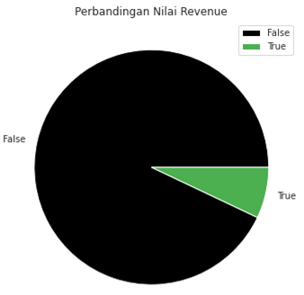
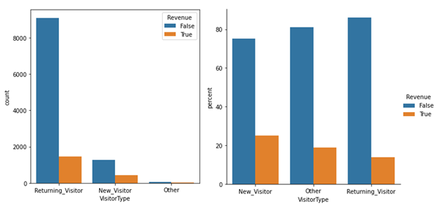
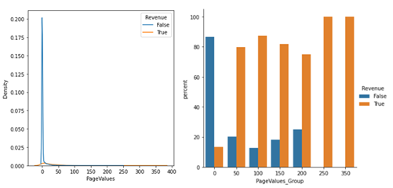
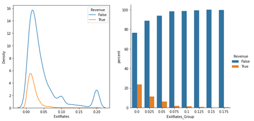
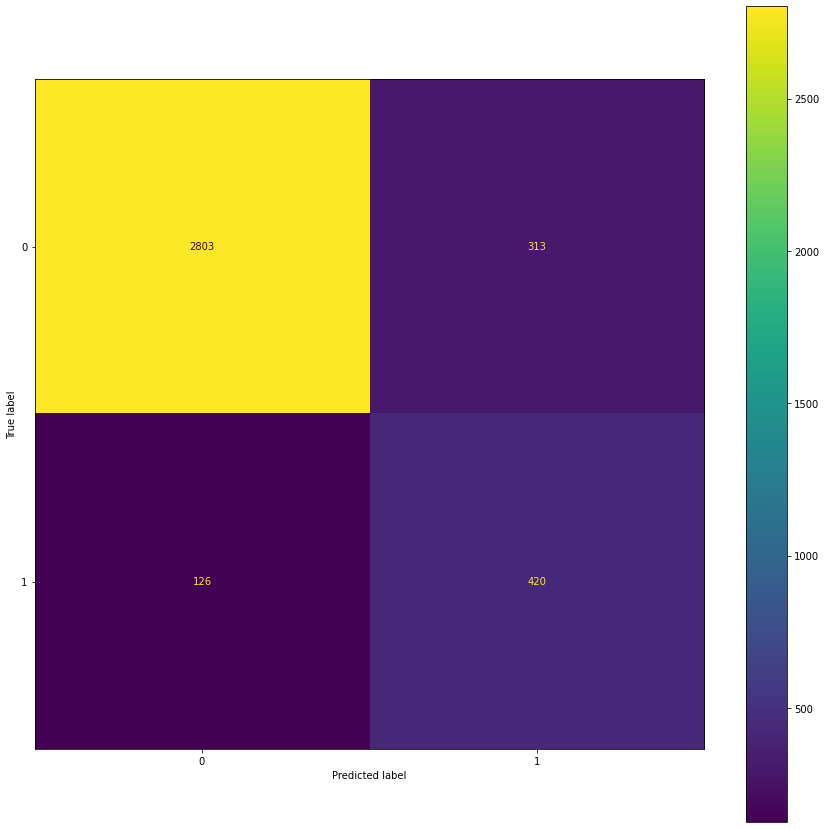

# Online Shoppers Purchasing Intention
_Predict wheter an online shopping will purchase._

### Dataset Description
The dataset used is [Online Shoppers Purchasing Intention](https://archive.ics.uci.edu/ml/datasets/Online+Shoppers+Purchasing+Intention+Dataset).

This dataset describes user behavior on an online sales site that is used to analyze and predict whether a user will make a purchase or not. Each row represents a user's session for a period of 1 year, while each column contains user attributes obtained from _Google Analytics_. There are a total of 12,330 sessions and 18 attributes (10 numerical and 8 categorical attributes).

### Problem Statement
From the total of 12,330 sessions in the dataset, 10,422 (84.5%) ended without making a purchase (Revenue = False). Meanwhile, only 1,908 (15.5%) buying sessions.

### Goals and Objectives
From the information provided in the dataset, insights will be extracted regarding what matters affect a session ending with a purchase or not. Furthermore, machine learning models are build to predict whether a user in a particular session will make a purchase or not based on existing attribute data.  
Basically, online shops want an increase revenue, which is in this case depends on the amount of revenue that occurs. This increase can be obtained through an increase in _Purchase conversion rate_, or the number of sessions that end up making purchases compared to all sessions that occur.

### Exploratory Data Analysis
We will find out the effect of each feature on the conversion rate.
#### Feature Categorical
Hypothesis testing was carried out using chi-square to determine the effect of categorical features on the Revenue value with a 5% confidence level. It was found that only Region feature that did not significantly influence the Revenue value.

Based on the plot above, majority of users who visit are _Returning Visitors_, but the percentage of users who make the largest purchases are _New Visitors_.  
In practice, users often regularly visit online shops to browse (_survey_) the products to be purchased. But it still needs to be reviewed whether there are other things that can be improved to increase the conversion rate of users who make repeated visits.

#### Feature Numerical
Out of a total of 10 numerical features, there are 2 features that have a significant correlation with the Revenue feature.

Page Values have a correlation with Revenue of +0.49. If you pay attention, a larger Page Values value has a higher conversion rate.

While Exit Rates have a correlation with Revenue of -0.21.

Based on the description above, online shops needs to pay attention to pages with high Page Values and low Exit Rates to optimize the conversion rate.

### Machine Learning Modelling and Evaluation

In this dataset, a model will be built to classify whether a user in a certain session will make a purchase or not, so that **Revenue** will be the target variable in this model. The dataset is divided into train data and test data. The following is the evaluation result of each model contain **score of data train/data test** after _hyperparameters tuning_.

|       Model       |ROC-AUC  |Accuracy |Precision|Recall   |
|-------------------|---------|---------|---------|---------|
|Logistic Regression|0.87/0.87|0.89/0.89|0.69/0.67|0.57/0.55|
|K-nearest Neighbor |0.89/0.87|0.890.88|0.66/0.62|0.61/0.57|
|Decision Tree      |0.92/0.89|0.90/0.88|0.65/0.58|0.75/0.71|
|Random Forest      |0.94/0.91|0.89/0.88|0.62/0.56|0.81/0.79|
|AdaBoost           |0.90/0.90|0.88/0.87|0.59/0.55|0.79/0.77|
|XGBoost            |0.92/0.91|0.89/0.88|0.62/0.57|0.79/0.77|

The scores that will be considered in the model training above are maximizing **precision** scores (minimizing True Positive; increasing _Purchase conversion rate_) and **recall** (minimizing False Negatives). Based on the above results, it was found that the best models were the XGBoost, AdaBoost, and Random Forest models respectively.

The following is the confusion matrix of the XGBoost model.
    

From the confusion matrix above, we obtained that the value of True Positive is 253 and False Negative is 158. The model can then be used to predict whether a user will make a purchase or not. Users who, based on the model, are predicted to make purchases, can be approached as marketing targets to optimize revenue addition options.  
Note that if an online shop only focuses on prioritizing its marketing to users who have the potential to make purchases (True Positive and False Positive), then marketing budget savings can be made so that the net income is even greater.  
In addition, it can be reviewed the trend of page values, exit rates, or other features for users who decide not to make a purchase.
    
### Conclusion
As a step to increase revenue through increasing the value of the purchase conversion rate, the online shop can do:
- Target marketing that is right on target according to the model's predicted results.
- Find out more about the factors that affect Page Values and Exit Rates.